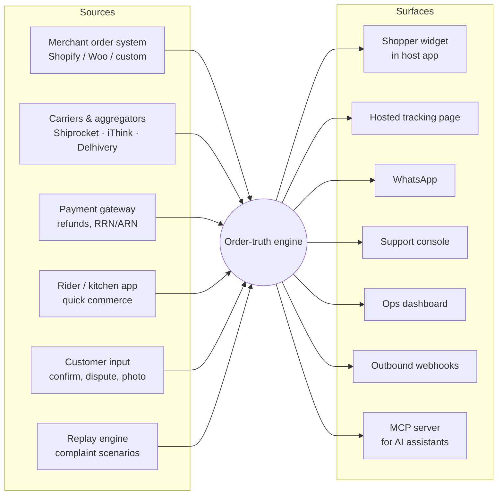
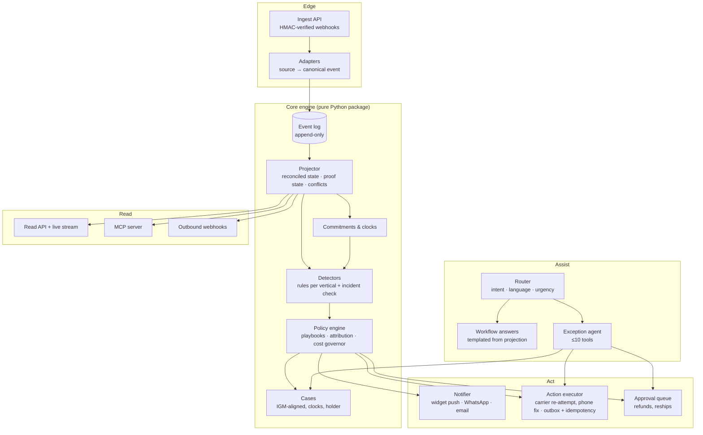

# Intelligent WISMO — Architecture & System Design

*Draft v0.1, 2026-09-29. Owner: Ishrajesh. Builds on `00-product-brief.md` and `01-design-brief.md`. Decisions are recorded in `docs/adr/`.*

## 1. Summary

An **order-truth engine** that any app can plug into. It ingests order, carrier, payment and customer events into an append-only log, derives what is *actually* known about each order (not what the loudest system says), runs rules and clocks to catch failures before the customer does, and exposes the result through an embeddable widget, a support console, an ops dashboard, WhatsApp, webhooks and an MCP server. A narrow AI agent handles open cases; humans approve anything that moves money.

It runs entirely on a laptop for demos (with a replay clock that compresses days into seconds) and deploys serverless to AWS Mumbai.

## 2. Requirements

### Functional

| # | Requirement | Traces to |
|---|---|---|
| F1 | Ingest order, shipment, payment, refund and customer events from any source through adapters | "integrate into any app" |
| F2 | Derive a reconciled order state with delivery **proof state** (none / claimed / verified / disputed) | 35 "marked delivered" complaints |
| F3 | Track **commitments** (ETA shown at checkout, revisions, refund-by, claim windows, statutory clocks) and fire when breached | 21 delay/stuck complaints; RBI T+5; E-Commerce Rules 48h/30d |
| F4 | Detect exceptions by rules per vertical, and incidents across orders (courier × pincode × day) | Dec 2025 cluster |
| F5 | Act: notify the customer first, ask "did you get it?", request re-attempt or phone fix, open a case, propose a remedy | support failures (36 of 40 who contacted support) |
| F6 | Cases with visible IDs, holders and clocks; cannot close while the exception is live | "ticket invisible", "closed as resolved" |
| F7 | Exception agent with tools, Hinglish, human approval for refunds/reships, always a human path | bot loops |
| F8 | Surfaces: widget (3 structures), hosted page, support console, ops dashboard, WhatsApp simulator, outbound webhooks, MCP | design brief |
| F9 | Replay engine: scenarios built from real complaint IDs, on a virtual clock | demo + evaluation |

### Non-functional

| Concern | Target (POC) | Note |
|---|---|---|
| Time from event to customer-visible update | < 5 s (live), instant on replay | WebSocket/SSE push |
| Detection latency after a rule's condition becomes true | < 1 min (clock tick) | durable timers, not polling jobs |
| Availability | Best effort (demo); design for 99.9% | managed serverless primitives |
| Tenancy | Hard isolation per host app | Postgres RLS with FORCE |
| Privacy | Data processor under DPDP: minimal PII, India region, erasure, audit | masked phone, pincode not full address |
| Cost | ~₹0 at demo volume; LLM spend only on exceptions | see §10 |
| Integration effort | New host skin + adapter in < 1 day | design tokens + generic contract |
| Accessibility | WCAG 2.1 AA | widget + consoles |

### Constraints

- Solo builder; small iterations. Serverless preferred (ADR-001).
- **No live data from Smytten, Swish or Zomato** (see §8). Demos run on replica apps fed by the replay engine.
- No real WhatsApp/SMS sending or payments in the POC (brief, cut list).

## 3. Context



## 4. Components



| Component | Responsibility | Key design choice |
|---|---|---|
| **Adapters** | Map each source's payload to canonical events; keep the raw code | Plugins behind one interface; push (webhook) and pull (poll) |
| **Event log** | Immutable facts with `asserted_by` | Event sourcing (ADR-002) |
| **Projector** | Per-source states, reconciled state, conflict flag, proof state | Idempotent; tolerates out-of-order events |
| **Commitments & clocks** | Promises and deadlines, each with a durable timer | Scheduler port; virtual clock for replay |
| **Detectors** | Named rules → exceptions; incident rate check across orders | Pure functions; per-vertical profiles |
| **Policy engine** | Exception → playbook → actions; decides who is at fault; caps compensation cost | Deterministic; Zomato cut its on-time guarantee over cost, so remedies are budgeted |
| **Cases** | Customer-visible issue with ID, category, holder, clocks | ONDC IGM shape; cannot close while exception is live |
| **Router / workflow / agent** | Support conversations | Workflow-first; agent only on exceptions (ADR-003) |
| **Approval queue** | Human decision on money-moving actions | Tenant thresholds; evidence bundle attached |
| **Read API / MCP / webhooks** | Same truth to every surface | One projection, many renderers |

## 5. Data model (core entities)

```text
Tenant(id, name, vertical_profile, theme_tokens, policy_doc, thresholds)
Order(id, tenant_id, external_ref, customer_ref, channel, placed_at, amount, payment_method)
Shipment(id, order_id, leg[forward|return], carrier, awb, consignee_phone_masked, pincode)
Event(id, tenant_id, order_id, shipment_id?, occurred_at, received_at,
      status, substatus, ondc_state?, raw_code, raw_message, location?,
      asserted_by[merchant|carrier|rider|payment|customer|engine], source_adapter, payload_hash)
OrderProjection(order_id, merchant_state, carrier_state, customer_claim,
      reconciled_state, conflict, proof_state[none|claimed|verified|disputed],
      proof_artifacts[otp|photo|geo|call|customer_confirm], confidence, updated_at)
Commitment(id, order_id, kind[eta|refund_by|claim_window|ack_48h|resolve_30d|rbi_t5|igm_2h|igm_24h],
      promised_at, due_at, shown_to_customer_text, superseded_by?, state[open|met|breached|void])
Exception(id, order_id, rule_id, opened_at, severity, holder[carrier|merchant|bank|customer], state, evidence)
Case(id, order_id, category[FLM|ORD|ITM], subcategory, opened_at, holder, state, clocks[], closed_reason?)
Refund(id, order_id, amount, method, stage[requested|approved|initiated|processed|credited|overdue], rrn_arn?, expected_credit_by)
ApprovalRequest(id, case_id, action[refund|reship|credit], amount, evidence_bundle, proposed_by, decided_by?, decision?, expires_at)
AuditLog(id, tenant_id, actor, action, target, before, after, at)   -- append-only, UPDATE/DELETE denied
```

Every table carries `tenant_id` with a row-level-security policy; the app connects as a non-owner role with `FORCE ROW LEVEL SECURITY`.

## 6. Key flows

### 6.1 "Marked delivered, nothing arrived" (parcel, Smytten demo)

```mermaid
sequenceDiagram
  participant C as Carrier adapter
  participant E as Engine
  participant W as Widget (Smytten)
  participant S as Shopper
  participant K as Support console
  C->>E: Delivered 14:02 (no OTP artifact, no OFD call)
  E->>E: proof_state = claimed · rule "delivered without proof" fires
  E->>E: open commitment "report window" (48 working hours)
  E-->>W: push: "Courier says delivered 14:02 · not confirmed by you"
  E-->>S: WhatsApp utility: "Did you get it? Yes / No"
  S->>W: No
  E->>E: proof_state = disputed · case FLM opened (ID shown) · clocks 48h ack / 30d resolve
  E->>C: request proof of delivery / re-attempt (async, idempotent)
  E->>K: case with evidence bundle; agent proposes reship → approval request
  K->>E: approve
  E-->>W: "Replacement approved · ships by Thu" (case stays open until received)
```

### 6.2 Quick commerce: rider stalled, then "delivered" (Swish demo)

Same engine, minute-scale profile: partner search > 8 min → proactive message with reason and new range (never a silent jump); rider stationary at pickup > 6 min → attribution "kitchen" vs "rider"; delivered tap without handover proof → "Did your food arrive?" with a report window counted from **verified** handover, not the rider's tap.

### 6.3 Refund stuck at "initiated"

Refund sub-timeline with method-aware expected credit date; no bank reference after N working days → exception; overdue → escalation pack (RRN/ARN, amount, dates) and the right route: UPI app dispute (auto-escalates after 3 days under NPCI UDIR), bank, then RBI CMS after 30 days. Failed payments with no order follow the RBI T+5 clock.

### 6.4 Incident (the December 2025 replay)

The incident detector sees the unverified-delivery rate for one courier in one city jump far above its baseline. It opens **one** incident, messages all affected customers proactively, and gives ops a single view, instead of 39 separate tickets and public complaints.

## 7. Interoperability & ease of use

### 7.1 Inbound: one contract, many adapters

```json
POST /v1/events   (HMAC-SHA256 signed, idempotent on event_id)
{
  "event_id": "evt_01J...",
  "order_ref": "SMY-4821208",
  "occurred_at": "2025-12-29T14:02:00+05:30",
  "type": "shipment.status",
  "status": "delivered",
  "raw": { "carrier": "delhivery", "code": "DL", "message": "Delivered" },
  "proof": { "otp_verified": false, "photo_url": null, "call_logged": false },
  "asserted_by": "carrier"
}
```

| Adapter tier | Examples | When |
|---|---|---|
| Generic webhook contract (above) | any custom stack, e.g. a Smytten-class OMS | Phase 1 |
| Replay adapter | complaint-derived scenarios | Phase 1 |
| Carrier aggregators | Shiprocket (token + webhook), iThink (free key), AfterShip/TrackingMore (track by AWB) | Phase 4 |
| Commerce platforms | Shopify fulfilment webhooks, WooCommerce REST | Phase 5 |
| Consumer-side, consent-based | forwarded order emails (schema.org ParcelDelivery, else LLM extraction), screenshot → state via vision model | Phase 5 |
| Open network | ONDC `/on_status`, `/on_track`, IGM `/issue` | Later (needs a registered entity) |

### 7.2 Outbound: three integration tiers for the host app

| Tier | Host effort | What they get |
|---|---|---|
| **0 · Hosted page** | Put a link in their SMS/email | Order truth page on our domain (cloud-edge platform style) |
| **1 · Embed** | Two lines of HTML | The widget in their app, themed by their tokens |
| **2 · Headless** | Call the API / listen to webhooks | Their own native UI on our truth |

```html
<script type="module" src="https://cdn.example/wismo.js"></script>
<wismo-order order-ref="SMY-4821208" variant="orders-row" theme="smytten" lang="en-IN"></wismo-order>
```

`variant` selects one of the three demo structures (`orders-row`, `tracking-card`, `after-delivered`); `theme` points to a DTCG design-token JSON compiled to CSS custom properties inside Shadow DOM, so host styles don't leak in and ours don't leak out.

### 7.3 AI surfaces

An **MCP server** (OAuth 2.1, scoped to tenant + customer) exposes `get_order_truth`, `list_exceptions`, `explain_delay`, `request_reattempt` (marked destructive so hosts prompt). Zomato and Swiggy both chose MCP as their public developer interface, so this is where host AI assistants will look. The same tool registry powers our own agent.

## 8. Feasibility: running "on top of" the real apps

| Host | Public integration surface | Verdict for this POC |
|---|---|---|
| **Smytten** | None; tracking in-app + SMS/email; no phone support | Replica app fed by replayed Delhivery-style events. Optional later: browser overlay on web.smytten.com order history |
| **Swish** | None; app-only, fully in-house kitchens, riders and software | Replica app. Most plausible real design partner: small, full-stack, and its 1-star reviews are pure WISMO |
| **Zomato** | Restaurant-POS webhooks only; its MCP server states it does not allow third-party apps | Replica app. Optional later: overlay on zomato.com orders (web tracking isn't live there) |
| **Swiggy / Instamart** | Builders Club MCP: prototype on localhost against real tool schemas; production needs review | **Phase 5 spike:** check whether any tool returns order status. If yes, this becomes the "real app" demo |
| **Any Shopify/Woo store + Shiprocket** | Documented webhooks and APIs | The real, distributable integration path (Phases 4–5) |

**Honest line for the pitch:** the engine and integration contract are real; the three host apps are faithful replicas because none of them exposes customer-order data to third parties. The adapters show exactly where their data would plug in.

## 9. Multi-tenancy, privacy and security

- **Isolation:** `tenant_id` everywhere; Postgres RLS with FORCE; per-tenant keys for webhook signing.
- **Minimisation:** masked phone (last 4); pincode, not full address, unless an address fix is in progress (then time-limited); no card or bank instrument data; refund references only.
- **DPDP posture:** we are the host's data processor; India region; per-tenant retention TTL (default 180 days); erasure endpoint; 72-hour breach runbook; no sending data to a model provider without the tenant's consent.
- **Evidence integrity:** in-app camera capture only (no gallery), timestamp + geofence checks. A Gemini-edited egg photo got a ₹245 Instamart refund in Nov 2025.
- **Agent safety:** strict tool schemas, approval queue, closure rules and audit log are enforced in code (ADR-003).

## 10. Scale, reliability and cost

**Load estimate (design target, one mid-size tenant):** 50,000 orders/day × ~10 events/order ≈ 500k events/day ≈ 6/s average, ~60/s at peak. Trivial for SQS FIFO + Lambda; the bottleneck would be the database's write rate, handled by batching projections.

**Reliability:**
- At-least-once delivery everywhere; idempotency on `event_id` and on outbound actions (outbox pattern).
- Per-order ordering via FIFO message groups; projector tolerates late events by `occurred_at`.
- Dead-letter queues with replay.
- Timers are durable schedules, never in-memory cron.
- Deadlines tolerate late carrier data: an ETA counts as missed only after a short grace (parcel 12 h, quick 3 min), and an on-time delivery that arrives late still counts as on time.

**LLM cost control:** status questions never hit the agent (templated); the router uses a small model; the exception agent runs only on open cases. At ~5% of orders reaching a conversation of ~6 turns, spend scales with exceptions rather than orders, which is the pricing story ("pay per resolved exception, not per shipment").

**Observability:** structured logs keyed by `order_id` and `case_id`; metrics per rule (fires, false alarms, lead time); traces across ingest → projection → notify.

## 11. Evaluation built into the architecture

- **Replay harness:** every complaint-derived scenario runs through the engine on a virtual clock and reports: detected? which rule? lead time vs the customer's complaint? false alarms on healthy synthetic orders?
- **Agent harness:** simulated users from real complaint texts (≥ 20% Hinglish); pass^3; procedural checks first, an LLM judge only after human-labelled calibration.
- **Anti-pattern tests:** never re-ask the order ID; never close a case with a live exception; human path always offered; ETA changes always carry a reason.

## 12. Trade-offs we accepted

| Decision | We gain | We give up |
|---|---|---|
| Event log over status column | Provenance, replay, dispute evidence | More storage and projection code |
| Rules over ML | Explainable flags, no training data needed | Manual threshold tuning |
| Workflow-first support | Cheap, reliable facts; no hallucinated dates | Less "magical" small talk |
| Human approval on money | Safety, trust | Slower refunds on edge cases |
| Replica host apps | Full control; every failure reproducible | Not live data (stated openly) |
| Ports & adapters | Runs on a laptop; cloud-portable | Two adapter sets to keep in sync |

## 13. What we'd revisit as it grows

- Per-tenant breach-prediction model once real event history exists.
- Snapshotting projections for very long-lived orders.
- A dedicated real-time service if WebSocket fan-out outgrows API Gateway.
- ONDC participation (needs a registered entity) and IGM as the external case protocol.
- Regional languages beyond English and Hinglish.
